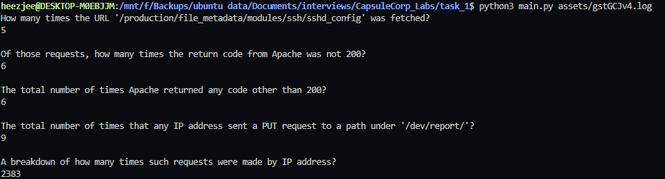

# Apache Access Log Parser

## Usage help

 ```python main.py --help```


## When required arguments are missing

```python main.py```


## When incorrect file path is passed

```python main.py /wrong/path```


## Successful sample output

```python main.py assets/gstGCJv4.log```

